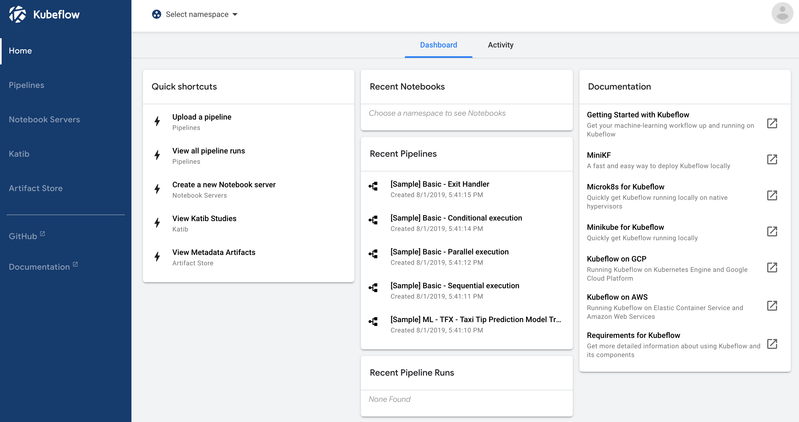

# Install Kubeflow on self-managed Kubernetes on AWS

This post will explain how to setup Kubeflow an self-managed Kubernetes cluster on AWS. Even though it uses kops for creating the cluster but it could've been created any other way, such as CloudFormation or Terraform.

- Install kops:

	```
  brew update && brew upgrade kops
  ```

- Setup env vars:

	```
	export NAME=kops.k8s.local
	export KOPS_STATE_STORE=s3://kops-state-store-aws
	export AWS_AVAILABILITY_ZONES="$(aws ec2 describe-availability-zones --query 'AvailabilityZones[].ZoneName' --output text | awk -v OFS="," '$1=$1')"
	```

- Create cluster:

	```
	kops create cluster ${NAME} --node-count=4 --zones=${AWS_AVAILABILITY_ZONES} --node-size=m5.2xlarge --master-size=m5.xlarge
	kops update cluster --name ${NAME} --yes
	```

- Optionally, install Kubernetes dashboard:

	```
	kubectl create -f https://raw.githubusercontent.com/kubernetes/kops/master/addons/kubernetes-dashboard/v1.10.1.yaml

	```

- Download Kubeflow:

	```
	curl -OL https://github.com/kubeflow/kubeflow/releases/download/v0.6.1/kfctl_v0.6.1_darwin.tar.gz
	```

- Setup Kubeflow:

	```
	export PATH=$PATH:/Users/argu/tools/kubeflow/0.6.1
	export KFAPP=kfapp
	export CONFIG="https://raw.githubusercontent.com/kubeflow/kubeflow/master/bootstrap/config/kfctl_k8s_istio.yaml"

	# Specify credentials for the default user.
	export KUBEFLOW_USER_EMAIL="admin@kubeflow.org"
	export KUBEFLOW_PASSWORD="12341234"

	kfctl init ${KFAPP} --config=${CONFIG} -V
	cd ${KFAPP}
	kfctl generate all -V
	kfctl apply all -V
	```

	Optionally, [Arrikto configuration](https://www.kubeflow.org/docs/started/getting-started-k8s/#Kubeflow-for-Existing-Clusters---by-Arrikto) may be used. In that case, `CONFIG` enviironment variable needs to be:

	```
	export CONFIG="https://raw.githubusercontent.com/kubeflow/kubeflow/master/bootstrap/config/kfctl_existing_arrikto.0.6.yaml"
	```

## Dashboard using Istio Ingress Gateway

### Using NodePort

- Get details about `istio-ingressgateway`:

	```
	kubectl get svc/istio-ingressgateway -n istio-system
	NAME                   TYPE           CLUSTER-IP     EXTERNAL-IP                                                              PORT(S)                                                                                                                                      AGE
	istio-ingressgateway   LoadBalancer   100.67.48.97   aced4d9a7b4bd11e9a59f0671efeaf73-301750868.us-west-2.elb.amazonaws.com   15020:31609/TCP,80:31380/TCP,443:31390/TCP,31400:31400/TCP,15029:30410/TCP,15030:31449/TCP,15031:32061/TCP,15032:32019/TCP,15443:30001/TCP   13h
	```

- Get internal IP address of the EC2 instance where `istio-ingressgateway` pod is running:

	```
	kubectl get pods -n istio-system -l app=istio-ingressgateway,istio=ingressgateway,release=istio --output=wide
	NAME                                    READY   STATUS    RESTARTS   AGE    IP           NODE                                           NOMINATED NODE
	istio-ingressgateway-5f55c95767-5ldtg   1/1     Running   0          135m   100.96.3.4   ip-172-20-123-226.us-west-2.compute.internal   <none>
	```

- Get public IP address:

	```
	aws ec2 describe-instances \
	--filters Name=private-dns-name,Values=ip-172-20-123-226.us-west-2.compute.internal \
	--query "Reservations[0].Instances[0].PublicDnsName" \
	--output text
	```

- Enable access to port `31380` in the security group. The security group name would be something like `nodes.<cluster-name>.k8s.local`.
- Access istio ingress endpoint:

	```
	open https://<public-ip>:31380
	```

	Kubeflow dashboard is accessible.

	

### Using LoadBalancer

- Run proxy:

	```
	kubectl proxy
	```

-	Access [Kubernetes Dashboard](http://localhost:8001/api/v1/namespaces/kube-system/services/https:kubernetes-dashboard:/proxy/)
- Select `Token`
- Generate token:

	```
	kops get secrets --type secret admin -oplaintext
	```

- Click on `SIGN IN`
- Access `istio-ingressgateway` in the dashboard http://localhost:8001/api/v1/namespaces/kube-system/services/https:kubernetes-dashboard:/proxy/#!/service/istio-system/istio-ingressgateway?namespace=istio-system
- Click on `EDIT` (top right)
- Replace `NodePort` with `LoadBalancer`
- Click on `Update`
- Wait for 3 minutes for the load balancer to be deployed
- Get endpoint address:

	```
	kubectl get svc -n istio-system istio-ingressgateway -o jsonpath='{.status.loadBalancer.ingress[0].hostname}'
	```

	Kubeflow dashboard is accessible.

### Using Arrikto

- Get Kubeflow dashboard endpoint address:

	```
	 kubectl get svc -n istio-system istio-ingressgateway -o jsonpath='{.status.loadBalancer.ingress[0].hostname}'
	```

- Access endpoint in the browser. It gives the error:

	```
	This page isn’t working a86596f68b0a511e998a30628ef7c2fc-315815572.us-west-2.elb.amazonaws.com didn’t send any data.
	```

- Pod is running:

	```
	kubectl get pods -n istio-system -l app=istio-ingressgateway
	NAME                                    READY   STATUS    RESTARTS   AGE
	istio-ingressgateway-5f55c95767-wj4w7   1/1     Running   0          12m
	```

- Endpoints are registered:

	```
	kubectl get endpoints -n istio-system istio-ingressgateway
	NAME                   ENDPOINTS                                                     AGE
	istio-ingressgateway   100.96.3.4:15031,100.96.3.4:15029,100.96.3.4:80 + 7 more...   13m
	```

- Pod logs seem fine:

	```
	2019-08-02T12:51:32.830632Z	info	Envoy proxy is ready
	[2019-08-02T12:55:29.269Z] "GET /dex/.well-known/openid-configuration HTTP/1.1" 200 - "-" 0 945 4 1 "172.20.34.128" "Go-http-client/1.1" "85878fb5-046b-9b9e-aa2c-1c01409d6cf5" "a07340f6cb52411e9ac6706f7eeacea4-1454642154.us-west-2.elb.amazonaws.com:5556" "100.96.1.7:5556" outbound|5556||dex.kubeflow.svc.cluster.local - 100.96.3.4:5556 172.20.34.128:56986 a07340f6cb52411e9ac6706f7eeacea4-1454642154.us-west-2.elb.amazonaws.com
	[2019-08-02T13:01:46.934Z] "GET / HTTP/1.1" 302 UAEX "-" 0 350 1 0 "100.96.3.1" "HTTP Banner Detection (https://security.ipip.net)" "5788a545-99f7-9716-8f0d-c46355f93a8b" "54.69.224.129" "-" - - 100.96.3.4:443 100.96.3.1:8736 -
	```

